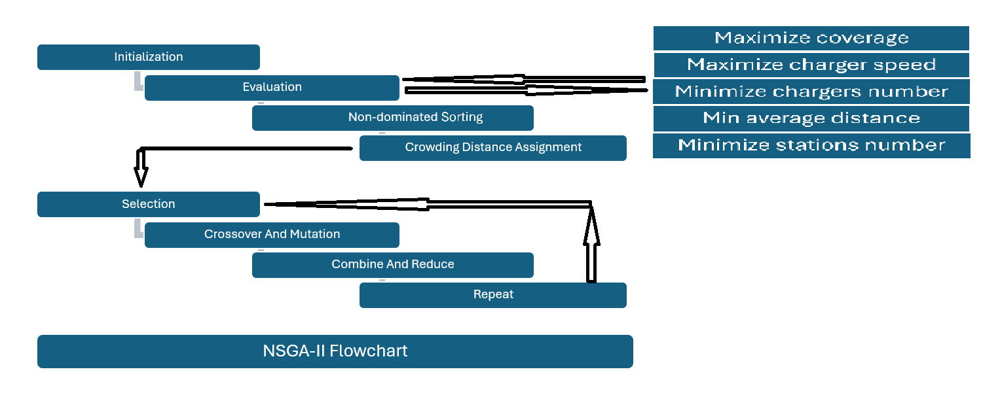
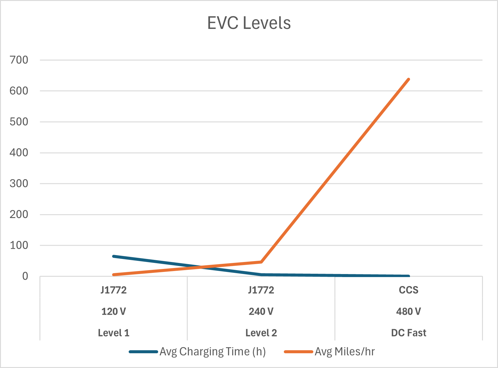
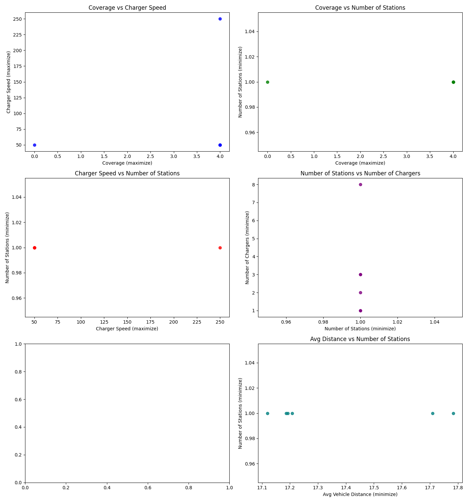
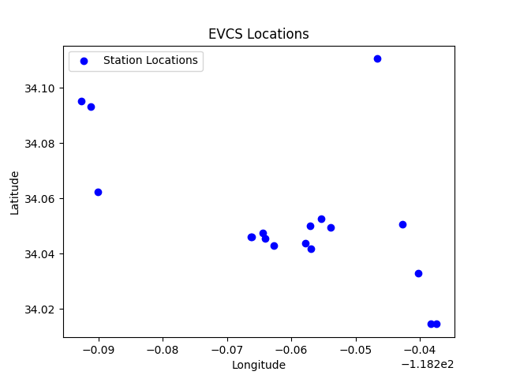
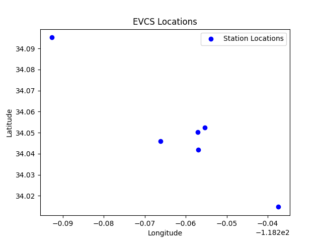
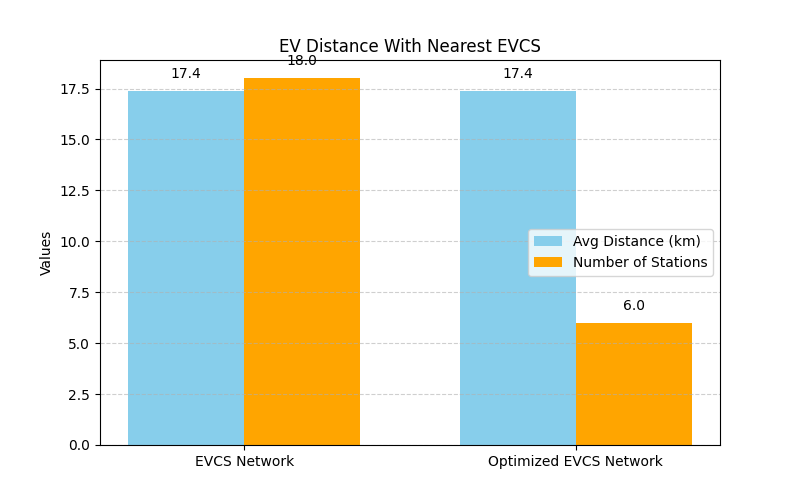
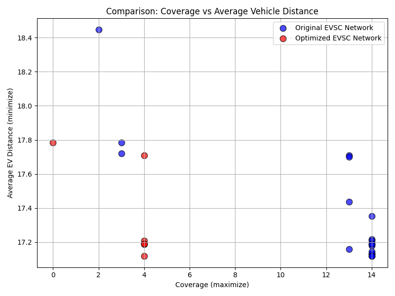
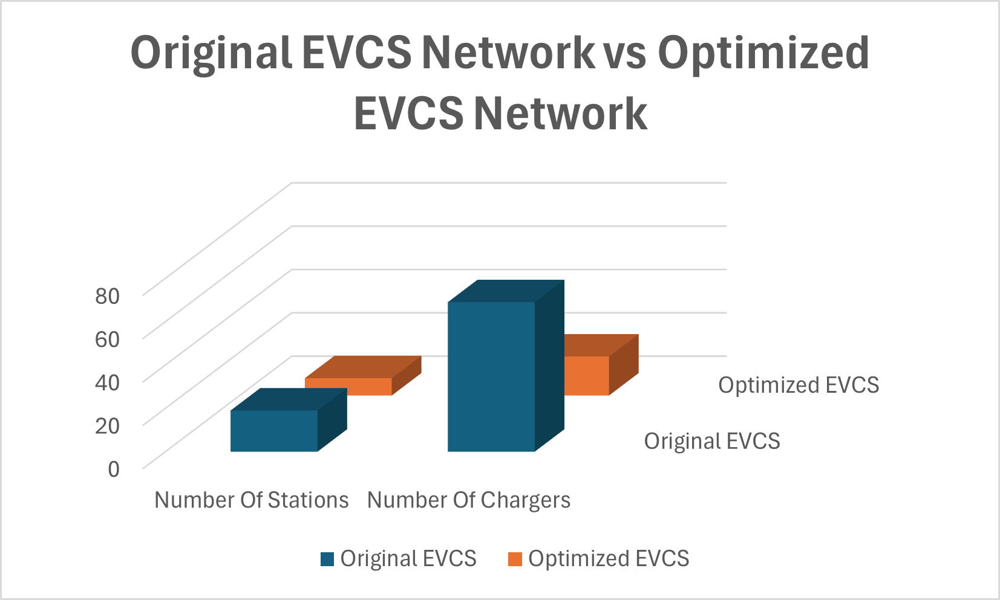
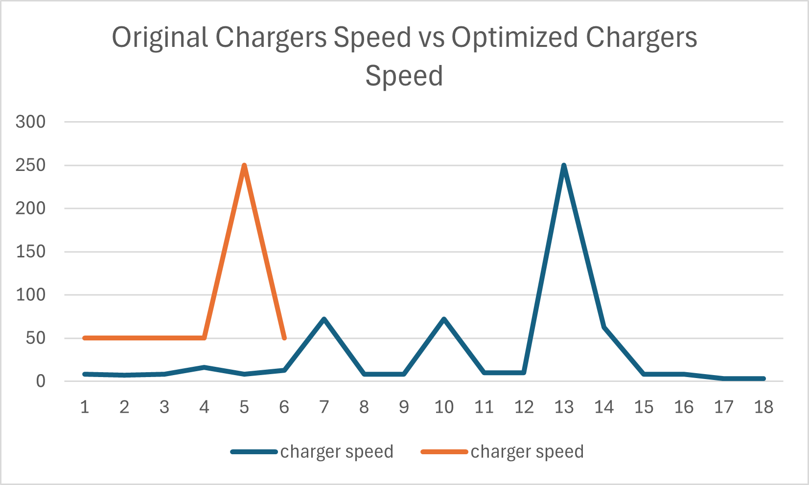
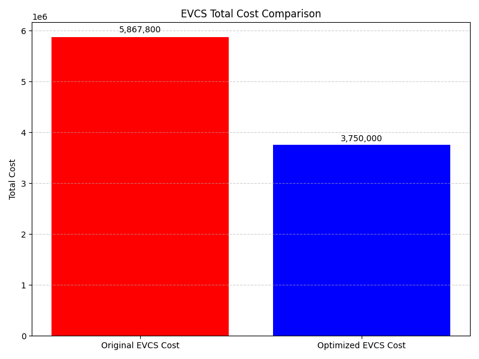

# MOEA
Multi objective Evolutionary Algorithms for the Electric vehicle charging stand infrastructure problem

## Required Libraries

To run this project, you will need to install the following Python libraries:

- `pandas` - For data manipulation and analysis.
- `numpy` - For numerical computing.
- `matplotlib` - For plotting and visualizing data.
- `scikit-fuzzy` - For fuzzy logic operations and control systems.
- `seaborn` - For statistical data visualization used with `matplotlib`.
- `scikit-learn` - For machine learning tasks, such as metrics, and evaluation.
- `pickle` - For storing and opening dataset
- `nbimporter` - For importing Jupyter Notebooks as Python modules.
- `deap` - For Genetic Programming and implementing evolutionary algorithms.
- `pymoo` - For multi-objective optimization algorithms.


### Installation
You can install the required libraries using `pip`. Here is a sample installation command:

```bash
pip install pandas numpy matplotlib scikit-fuzzy seaborn scikit-learn nbimporter

# Results














```
